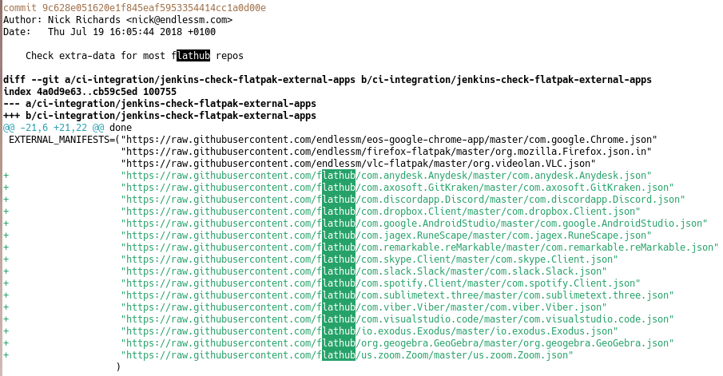

# Title

Good morning from London in the United Kingdom! My name is Will Thompson. I'm an engineering director at Endless OS Foundation. [Endless OS Foundation blurb.]

Today I'm going to talk about Flatpak External Data Checker. I'll explain what it is, tell you a bit about its history, and what it's doing today. I'll give some examples of how you can use it yourself, and ways that you can get involved in the project.

We'll have some time at the end for questions, so if you have any questions during the talk, please leave them in the shared notes section of the chat. If you're watching the recording and have any questions, please get in touch: my contact details are on this slide.

# What is Flatpak?

[Flatpak & Flathub logos]

 

To understand the motivation for this tool, it helps to know a few facts about Flatpak instelf. Quoting from its website,

> Flatpak is a next-generation technology for building and distribution desktop applications on Linux.

Applications are built and run in a predictable environment, regardless of the Linux distribution they're running on. Anyone can host a repository of Flatpak applications, and users can have applications installed from several repositories at once. Perhaps the most prominent Flatpak repository is Flathub, which is a vendor-neutral project hosting a mixture of open source and proprietary applications, and this is the one I'll be concentrating on today. But whenever I say “Flathub”, you can imagine a footnote saying “or another Flatpak repository which works like Flathub”.

On Flathub, the build process for most apps is defined by a *manifest* file in JSON or YAML format, stored in a repository on GitHub. The manifest is essentially a list of all the app's dependencies, and how to build and install each one from source code in sequence, followed by how to build and install the app itself. The source code for the app and its dependencies is not stored in the Git repository: the manifest contains URLs to the source code, and these are downloaded when Flathub builds the app. For some apps the manifest is very simple, because all the necessary dependencies are already present in the Flatpak runtime. Some other apps have hundreds or thousands of dependencies, typically from PyPI or NPM, and these apps' manifests are generated by other tools. Most apps are somewhere in the middle, with a small handful of dependencies and a manifest maintained by hand.

Two of the other prominent Flatpak repositories are the GNOME Nightly repository and Fedora's Flatpak repository. Apps in these repositories tend not to need the kind of automation I'm about to describe, and in the case of Fedora are built by a completely different process, so this tool is not relevant to them. If you're interested in how Fedora Flatpaks are built, stick around for the next talk!

## Extra Data

[Skype installation diagram]

Normally, when Flathub builds a Flatpak application, the resulting files are stored as an immutable snapshot, which users then just download from the repository. But Flatpak has a somewhat-unusual feature, which allows apps to download and unpack additional files from third-party servers when they are installed. This feature mainly exists to support installing proprietary applications using Flatpak despite the repository owner not having permission to redistribute them.

For example, here's what happens when you install Skype from Flathub. First, Flatpak on your computer fetches and installs the `com.skype.Client` Flatpak from Flathub, and the FreeDesktop.org runtime it depends on if you don't already have it installed. This Flatpak app contains the open-source libraries that Skype depends on, like v4l-utils and libsecret, but it doesn't actually contain Skype itself. Instead, it contains the URL to the `.deb` package of Skype, the expected size and SHA256 checksum of that file, and a script to unpack it.

Next, Flatpak on your computer downloads that file, directly from Skype. It verifies that the `.deb` file has the expected size and checksum, and then it runs the script provided by the Flatpak app to unpack it. This script is run in a strict sandbox, and once it's finished, the files it's extracted are made read-only, just like all the other files in a Flatpak app. Flathub didn't distribute Skype itself, but the end result once you install the app is almost the same as if it had.

## Extra Data gone bad

[Diagram of two failure cases]

Perhaps you can already see the ways this can go wrong. When a new version of Skype is released, the URL to the old version will eventually stop working, so if the Flatpak app is not updated before then, new users will not be able to install it. Even worse, sometimes vendors publish a new version of an app at the same URL as the old version. Since the new version will have a different checksum, Flatpak will refuse to unpack it, and again installation will fail.

So, we need a way to keep these extra-data Flatpaks up-to-date, ideally automatically.

# History lesson

## Endless OS, 2016


Cast your mind back to the middle of 2016. Try not to think about the political stuff that was happening at the time, and concentrate on computers. `xdg-app` had been rebranded as Flatpak, and Endless OS was being rebuilt to use Flatpak for apps. I borrowed this image from the [press release announcing Flatpak](https://flatpak.org/press/2016-06-21-flatpak-released/) back in 2016.

Endless OS is a desktop OS with some properties borrowed from mobile OSes. Like iOS and Android, but unlike most traditional Linux distributions, each release of Endless OS is an immutable OSTree snapshot. So although it's derived from Debian, it's not possible to install new apps using tools like `dpkg`. Apps can be installed using Flatpak, which means each app is also an hermetically-sealed snapshot. Among other things, this is great for robust automatic updates, both of the OS and of the apps.

Endless OS has many unique apps for offline content, built using a custom Flatpak runtime and build pipeline, and published in our own Flatpak repository. But, of course, users need regular apps too, for productivity, creativity and chaos.

## ???


Back in those days, Flathub didn't exist, so we built & published a bunch of third-party apps in our own Flatpak repository, too. Most of them were open-source, but our users expected to be able to use Skype, Spotify and Dropbox, so these were built as extra-data apps. Joaquim Rocha wrote a Jenkins job that would check for new versions of these apps, and email the team if the Flatpaks needed to be updated.

As the list of third party apps grew, the script got more complicated. Joaquim rewrote it in Python, and published it as `flatpak-external-data-checker`.

## Flathub, 2018



```diff
commit 9c628e051620e1f845eaf5953354414cc1a0d00e
Author: Nick Richards <nick@endlessm.com>
Date:   Thu Jul 19 16:05:44 2018 +0100

    Check extra-data for most flathub repos

diff --git a/ci-integration/jenkins-check-flatpak-external-apps b/ci-integration/jenkins-check-flatpak-external-apps
index 4a0d9e63..cb59c5ed 100755
--- a/ci-integration/jenkins-check-flatpak-external-apps
+++ b/ci-integration/jenkins-check-flatpak-external-apps
@@ -21,6 +21,22 @@ done
 EXTERNAL_MANIFESTS=("https://raw.githubusercontent.com/endlessm/eos-google-chrome-app/master/com.google.Chrome.json"
                     "https://raw.githubusercontent.com/endlessm/firefox-flatpak/master/org.mozilla.Firefox.json.in"
                     "https://raw.githubusercontent.com/endlessm/vlc-flatpak/master/org.videolan.VLC.json"
+                    "https://raw.githubusercontent.com/flathub/com.anydesk.Anydesk/master/com.anydesk.Anydesk.json"
+                    "https://raw.githubusercontent.com/flathub/com.axosoft.GitKraken/master/com.axosoft.GitKraken.json"
+                    "https://raw.githubusercontent.com/flathub/com.discordapp.Discord/master/com.discordapp.Discord.json"
+                    "https://raw.githubusercontent.com/flathub/com.dropbox.Client/master/com.dropbox.Client.json"
+                    "https://raw.githubusercontent.com/flathub/com.google.AndroidStudio/master/com.google.AndroidStudio.json"
+                    "https://raw.githubusercontent.com/flathub/com.jagex.RuneScape/master/com.jagex.RuneScape.json"
+                    "https://raw.githubusercontent.com/flathub/com.remarkable.reMarkable/master/com.remarkable.reMarkable.json"
+                    "https://raw.githubusercontent.com/flathub/com.skype.Client/master/com.skype.Client.json"
+                    "https://raw.githubusercontent.com/flathub/com.slack.Slack/master/com.slack.Slack.json"
+                    "https://raw.githubusercontent.com/flathub/com.spotify.Client/master/com.spotify.Client.json"
+                    "https://raw.githubusercontent.com/flathub/com.sublimetext.three/master/com.sublimetext.three.json"
+                    "https://raw.githubusercontent.com/flathub/com.viber.Viber/master/com.viber.Viber.json"
+                    "https://raw.githubusercontent.com/flathub/com.visualstudio.code/master/com.visualstudio.code.json"
+                    "https://raw.githubusercontent.com/flathub/io.exodus.Exodus/master/io.exodus.Exodus.json"
+                    "https://raw.githubusercontent.com/flathub/org.geogebra.GeoGebra/master/org.geogebra.GeoGebra.json"
+                    "https://raw.githubusercontent.com/flathub/us.zoom.Zoom/master/us.zoom.Zoom.json"
                    )
 
 DOWNLOAD_DIR="externalmanifests"
```

In 2018, Flathub was born. We enabled it by default in Endless OS, and began moving third-party apps from our own Flatpak repository into Flathub: the open-source ones, and the ones using extra-data.

I found a funny commit from Nick Richards from July 2018. Nick used to work at Endless, and is still very much involved with Flathub. The commit message reads:

> Check extra-data for most flathub repos

but it only checks sixteen apps! As we'll see later on, Flathub has come a long way since then.

At this point, the process was still the same: when an app needed to be updated, the dev team at Endless would get an email from Jenkins, and someone would have to go and manually update the relevant manifest.

## Automation


It came to pass that I was often the one responding to those emails. I got tired of doing it all by hand, so at the start of 2019 I taught `flatpak-external-data-checker` to update the Flatpak manifest and open a pull request.

This seems to have been the first pull request it opened, at least when running automatically rather than me running it by hand. It was actually declined, because someone manually opened another pull request for a slightly newer version of the app shortly afterwards!

One of the really nice things about this workflow is that Flathub's own continuous integration automatically makes a test build of every pull request. So as an app maintainer, you just have to install and test that test build, and (assuming it works) accept the pull request.

## Move to Flathub


By the end of 2019, Bartłomiej Piotrowski had deployed this tool on Flathub's own infrastructure, and we moved the repository to the Flathub organisation. He set it up to check any app on Flathub that had opted in.

Making the tool more “official” had several nice results. Before, some Flathub contributors had been hesitant to integrate with a tool running on Endless's private CI infrastructure; as part of the Flathub organisation, they were happy to opt in, safe in the knowledge that the Flathub administrators could intervene as needed. It was also made a [requirement](https://github.com/flathub/flathub/wiki/App-Requirements#external-data-checker) that new extra-data apps submitted to Flathub should integrate with this tool, which of course helped with its adoption. Together, these also led to more people contributing to the project.

This PR for Zoom seems to have been the first one opened by the Flathub instance of this tool. You might also notice that it's learned to update the appdata.xml file with the version number and release date of the new version of Zoom.

## Enter gasinvein -- TODO, move this later.


Around the end of 2020, a pseudonymous and prolific Flatpak community member, *gasinvein*, made some nice contributions, so I made him a co-maintainer of the project. I think these graphs of number of commits and number of lines added speak for themselves!

# How do I use it?

Hopefully, I've convinced you that this tool is useful to maintainers of Flatpak apps. Or perhaps you are submitting an extra-data app to Flathub and have discovered that this tool is mandatory. :-) How do you actually use it?

In short, you need to add some special annotations to the app's manifest to tell Flatpak External Data Checker how to check for new versions of the app. It has almost a dozen different checkers for various scenarios. I won't describe them all here but I'll give a few illustrative examples.

## Rotating URL


```json
{
    "type": "extra-data",
    "filename": "zoom.tar.xz",
    "only-arches": [
        "x86_64"
    ],
    "url": "https://cdn.zoom.us/prod/5.6.16888.0424/zoom_x86_64.tar.xz",
    "sha256": "7705fc77017cc638ecbc94e30682ec884ea0d2a5fe2ff74a35e5592ab73efef9",
    "size": 51534688,
    "x-checker-data": {
        "type": "rotating-url",
        "url": "https://zoom.us/client/latest/zoom_x86_64.tar.xz",
        "pattern": "https://.*/prod/([^/]+)/zoom_x86_64.tar.xz"
    }
}
```

Here's a simple example for Zoom. Zoom has a special URL which always redirects to the latest version of the app. So in the section of the manifest which tells Flatpak where to download the file at installation time, we add an `x-checker-data` section with configuration for the checker. We tell it to use the `rotating-url` checker; we tell it the URL that redirects to the latest version of Zoom; and we provide a regular expression to extract the version number from that target URL.

That's all you need to do. Every hour, Flathub runs the external data checker on this repo; if it finds an update, it opens a pull request. Because we told it how to extract the version number, it can also update the *appdata* file in the repository.

## AppImage & merging automatically


```yaml
sources:
  - type: extra-data
    filename: UnityHubSetup.AppImage
    url: https://public-cdn.cloud.unity3d.com/hub/prod/UnityHub.AppImage
    sha256: 3a28930395f135834294f8fdeb70dbe86515d7092eed5695ce973c143f6cf948
    size: 80621214
```

Here's another example for Unity Hub, which is a app which can be used in turn to download and run Unity, the popular game development platform. Unity Hub is distributed as an AppImage file, which funnily enough is a competing Linux app distribution tool. Flatpak External Data Checker has special handling for `.AppImage` files – it unpacks them to find the version number within.

This is an example of the situation I described earlier, where each new version is published at the same URL as the old one; so every time a new version of Unity Hub is released, the Flatpak can't be installed until its manifest is updated on Flathub.

Generally, a human being is expected to have tested that an app update works before publishing it on Flathub, so the external data checker just opens a pull request and waits for a human to merge it. But in this case, it detects that the existing version on Flathub is broken, and will automatically merge its own PR if its CI checks pass.

So the happy news here is: no extra configuration was needed in the manifest to let the checker do its thing.

## Snapcraft

```json
{
    "type": "extra-data",
    "filename": "spotify.snap",
    "only-arches": [
        "x86_64"
    ],
    "url": "https://api.snapcraft.io/api/v1/snaps/download/pOBIoZ2LrCB3rDohMxoYGnbN14EHOgD7_46.snap",
    "sha256": "441e022ef186ef4278558490a61962b8940b398baa7934311a3c3d01d43b46c9",
    "size": 188289024,
    "x-checker-data": {
        "type": "snapcraft",
        "name": "spotify",
        "channel": "stable"
    }
}
```

Surprise! You came to a Flatpak talk, and now I'm going to talk about Snap!

## Anitya

## GNOME