# Title

Good morning from London in the United Kingdom! My name is Will Thompson. I'm an engineering director at Endless OS Foundation. 
Our mission is to help all people and communities connect with technology. I'll say a bit more about Endless OS itself later.

Today I'm going to talk about Flatpak External Data Checker, which helps keep Flatpaks up-to-date with new releases of the app or its dependencies. I'll explain what it does, tell you a bit about its history, and what it's doing today. I'll give some examples of how you can use it yourself, and ways that you can get involved in the project.

We'll have some time at the end for questions, so if you have any questions during the talk, please leave them in the shared notes section of the chat. If you're watching the recording and have any questions, please get in touch: my contact details are on this slide.

# What is Flatpak?

<!--
 
-->

To understand the motivation for this tool, it helps to know a few facts about Flatpak instelf. Quoting from its website,

> Flatpak is a next-generation technology for building and distributing desktop applications on Linux.

Applications are built and run in a predictable environment, regardless of the Linux distribution they're running on. Anyone can host a repository of Flatpak applications, and users can have applications installed from several repositories at once. Perhaps the most prominent Flatpak repository is Flathub, which is a vendor-neutral project hosting a mixture of open source and proprietary applications, and this is the one I'll be concentrating on today. But whenever I say “Flathub”, you can imagine a footnote saying “or another Flatpak repository which works like Flathub”.

On Flathub, the build process for most apps is defined by a *manifest* file in JSON or YAML format, stored in a repository on GitHub. The manifest is essentially a list of all the app's dependencies, and how to build and install each one from source code in sequence, followed by how to build and install the app itself. The source code for the app and its dependencies is not stored in the Git repository: the manifest contains URLs to the source code, and these are downloaded when Flathub builds the app. For some apps the manifest is very simple, because all the necessary dependencies are already present in the Flatpak runtime. Some other apps have hundreds or thousands of dependencies, typically from PyPI or NPM, and these apps' manifests are generated by other tools. Most apps are somewhere in the middle, with a small handful of dependencies and a manifest maintained by hand.

Two of the other prominent Flatpak repositories are the GNOME Nightly repository and Fedora's Flatpak repository. Apps in these repositories tend not to need the kind of automation I'm about to describe, and in the case of Fedora are built by a completely different process, so this tool is not relevant to them. If you're interested in how Fedora Flatpaks are built, stick around for the next talk!

## Extra Data

[Skype installation diagram]

Normally, when Flathub builds a Flatpak application, the resulting files are stored as an immutable snapshot, which users then just download from the repository. But Flatpak has a somewhat-unusual feature, which allows apps to download and unpack additional files from third-party servers when they are installed. This feature mainly exists to support installing proprietary applications using Flatpak despite the repository owner not having permission to redistribute them.

For example, here's what happens when you install Skype from Flathub. First, Flatpak on your computer fetches and installs the `com.skype.Client` Flatpak from Flathub, and the FreeDesktop.org runtime it depends on if you don't already have it installed. This Flatpak app contains the open-source libraries that Skype depends on, like v4l-utils and libsecret, but it doesn't actually contain Skype itself. Instead, it contains the URL to the `.deb` package of Skype, the expected size and SHA256 checksum of that file, and a script to unpack it.

Next, Flatpak on your computer downloads that file, directly from Skype. It verifies that the `.deb` file has the expected size and checksum, and then it runs the script provided by the Flatpak app to unpack it. This script is run in a strict sandbox, and once it's finished, the files it's extracted are made read-only, just like all the other files in a Flatpak app. Flathub didn't distribute Skype itself, but the end result once you install the app is almost the same as if it had.

## Extra Data gone bad

[Diagram of two failure cases]

Perhaps you can already see the ways this can go wrong. When a new version of Skype is released, the URL to the old version will eventually stop working, so if the Flatpak app is not updated before then, new users will not be able to install it. Even worse, sometimes vendors publish a new version of an app at the same URL as the old version. Since the new version will have a different checksum, Flatpak will refuse to unpack it, and again installation will fail.

So, we need a way to keep these extra-data Flatpaks up-to-date, ideally automatically.

# History lesson

## Endless OS, 2016


Cast your mind back to the middle of 2016. Try not to think about the political stuff that was happening at the time, and concentrate on computers. `xdg-app` had been rebranded as Flatpak, and Endless OS was being rebuilt to use Flatpak for apps. I borrowed this image from the [press release announcing Flatpak](https://flatpak.org/press/2016-06-21-flatpak-released/) back in 2016.

Endless OS is a desktop OS with some properties borrowed from mobile OSes. Like iOS and Android, but unlike most traditional Linux distributions, each release of Endless OS is an immutable OSTree snapshot. So although it's derived from Debian, it's not possible to install new apps using tools like `dpkg`. Apps can be installed using Flatpak, which means each app is also an hermetically-sealed snapshot. Among other things, this is great for robust automatic updates, both of the OS and of the apps.

Endless OS has many unique apps for offline content, built using a custom Flatpak runtime and build pipeline, and published in our own Flatpak repository. But, of course, users need regular apps too, for productivity, creativity and chaos.

## Bootstrapping the App Center


Back in those days, Flathub didn't exist, so we built & published a bunch of third-party apps in our own Flatpak repository, too. Most of them were open-source, but our users expected to be able to use Skype, Spotify and Dropbox, so these were built as extra-data apps. Joaquim Rocha wrote a Jenkins job that would check for new versions of these apps, and email the team if the Flatpaks needed to be updated.

As the list of third party apps grew, the script got more complicated. Joaquim rewrote it in Python, and published it as the first version of `flatpak-external-data-checker`.

## Flathub, 2018

```diff
commit 9c628e051620e1f845eaf5953354414cc1a0d00e
Author: Nick Richards <nick@endlessm.com>
Date:   Thu Jul 19 16:05:44 2018 +0100

    Check extra-data for most flathub repos

diff --git a/ci-integration/jenkins-check-flatpak-external-apps b/ci-integration/jenkins-check-flatpak-external-apps
index 4a0d9e63..cb59c5ed 100755
--- a/ci-integration/jenkins-check-flatpak-external-apps
+++ b/ci-integration/jenkins-check-flatpak-external-apps
@@ -21,6 +21,22 @@ done
 EXTERNAL_MANIFESTS=("https://raw.githubusercontent.com/endlessm/eos-google-chrome-app/master/com.google.Chrome.json"
                     "https://raw.githubusercontent.com/endlessm/firefox-flatpak/master/org.mozilla.Firefox.json.in"
                     "https://raw.githubusercontent.com/endlessm/vlc-flatpak/master/org.videolan.VLC.json"
+                    "https://raw.githubusercontent.com/flathub/com.anydesk.Anydesk/master/com.anydesk.Anydesk.json"
+                    "https://raw.githubusercontent.com/flathub/com.axosoft.GitKraken/master/com.axosoft.GitKraken.json"
+                    "https://raw.githubusercontent.com/flathub/com.discordapp.Discord/master/com.discordapp.Discord.json"
+                    "https://raw.githubusercontent.com/flathub/com.dropbox.Client/master/com.dropbox.Client.json"
+                    "https://raw.githubusercontent.com/flathub/com.google.AndroidStudio/master/com.google.AndroidStudio.json"
+                    "https://raw.githubusercontent.com/flathub/com.jagex.RuneScape/master/com.jagex.RuneScape.json"
+                    "https://raw.githubusercontent.com/flathub/com.remarkable.reMarkable/master/com.remarkable.reMarkable.json"
+                    "https://raw.githubusercontent.com/flathub/com.skype.Client/master/com.skype.Client.json"
+                    "https://raw.githubusercontent.com/flathub/com.slack.Slack/master/com.slack.Slack.json"
+                    "https://raw.githubusercontent.com/flathub/com.spotify.Client/master/com.spotify.Client.json"
+                    "https://raw.githubusercontent.com/flathub/com.sublimetext.three/master/com.sublimetext.three.json"
+                    "https://raw.githubusercontent.com/flathub/com.viber.Viber/master/com.viber.Viber.json"
+                    "https://raw.githubusercontent.com/flathub/com.visualstudio.code/master/com.visualstudio.code.json"
+                    "https://raw.githubusercontent.com/flathub/io.exodus.Exodus/master/io.exodus.Exodus.json"
+                    "https://raw.githubusercontent.com/flathub/org.geogebra.GeoGebra/master/org.geogebra.GeoGebra.json"
+                    "https://raw.githubusercontent.com/flathub/us.zoom.Zoom/master/us.zoom.Zoom.json"
                    )
 
 DOWNLOAD_DIR="externalmanifests"
```

In 2018, Flathub was born. We enabled it by default in Endless OS, and began moving third-party apps from our own Flatpak repository into Flathub: the open-source ones, and the ones using extra-data.

I found a funny commit from Nick Richards from July 2018. Nick used to work at Endless, and is still very much involved with Flathub. The commit message reads:

> Check extra-data for most flathub repos

but it only checks sixteen apps! As we'll see later on, Flathub has come a long way since then.

At this point, the process was still the same: when an app needed to be updated, the dev team at Endless would get an email from Jenkins, and someone would have to go and manually update the relevant manifest.

## Automation

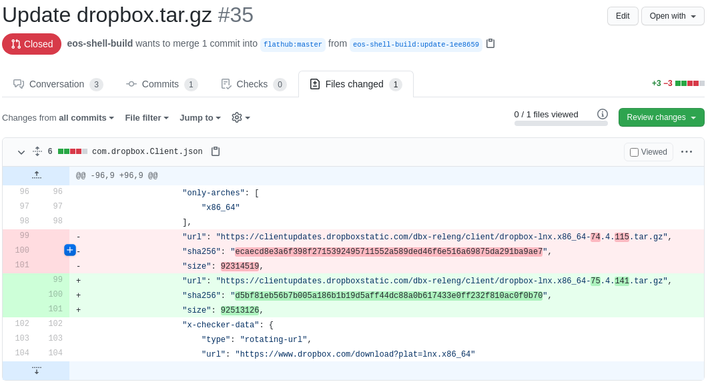

It came to pass that I was often the one responding to those emails. I got tired of doing it all by hand, so at the start of 2019 I taught `flatpak-external-data-checker` to update the Flatpak manifest and open a pull request. At this point, it was still running out of Endless’s Jenkins, as the cryptically-named GitHub user `eos-shell-build`.

This seems to have been the first pull request it opened, at least when running on Jenkins, rather than me running it by hand on my development system with my own API key. It was actually declined, because someone manually opened another pull request for a slightly newer version of the app shortly afterwards!

One of the really nice things about this workflow is that Flathub's own continuous integration automatically makes a test build of every pull request. So as a maintainer, you just have to install and test that test build, and (assuming it works) accept the pull request.

## Move to Flathub

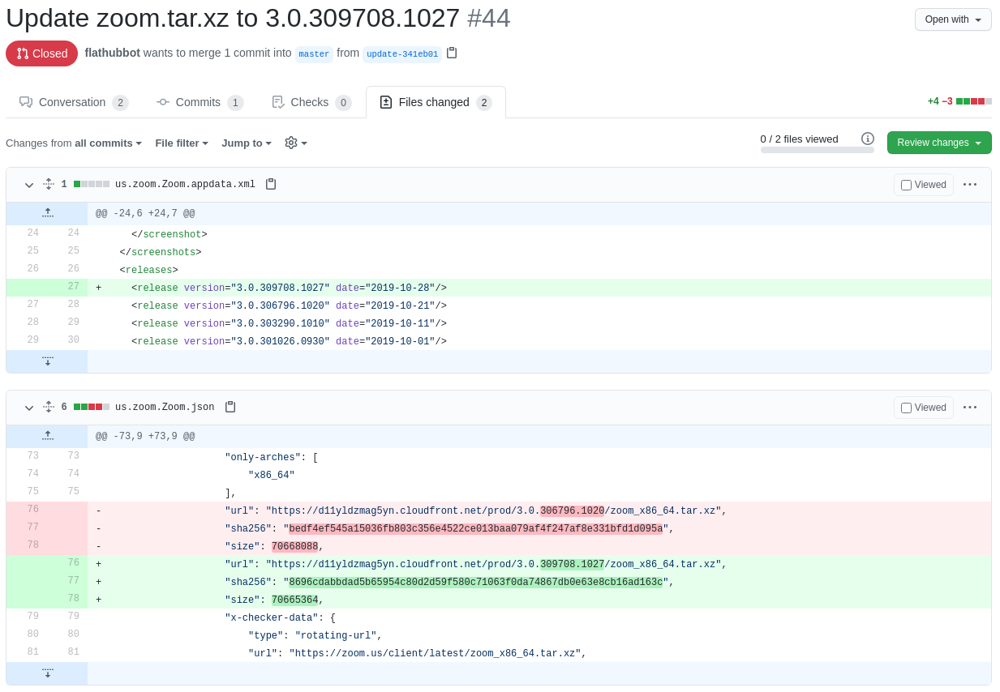

Bartłomiej Piotrowski is a DevOps engineer at the GNOME Foundation, and is one of the main administrators of Flathub.
Near the end of 2019, he deployed Flatpak External Data Checker on Flathub's own infrastructure, and we moved the repository to the Flathub organisation. He set it up to run every hour, and check any app on Flathub that had the appropriate configuration in its manifest.

Making the tool more “official” had several nice results. Before, some Flathub contributors had been hesitant to integrate with a tool running on Endless's private CI infrastructure; as part of the Flathub organisation, they were happy to opt in, safe in the knowledge that the Flathub administrators could intervene as needed. It was also made a [requirement](https://github.com/flathub/flathub/wiki/App-Requirements#external-data-checker) that new extra-data apps submitted to Flathub should integrate with this tool, which of course helped with its adoption. Together, these also led to more people contributing to the project.

This PR for Zoom seems to have been the first one opened by the Flathub instance of this tool. It's running as the GitHub user `flathubbot`, which is also the user which announces the URLs for test builds. These two systems actually don't know anything about each other – they just happen to run as the same user.

You might also notice that it's learned to update the appdata.xml file with the version number and release date of the new version of Zoom.

## Becoming a general-purpose app updater

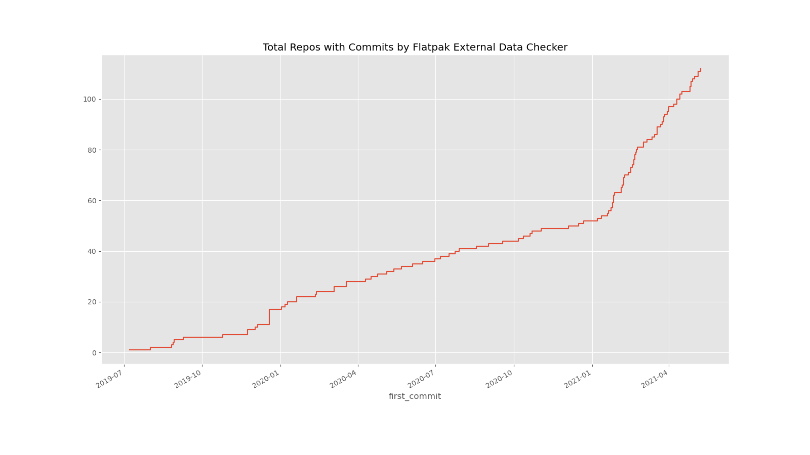

When it was rolled out to Flathub, something interesting happened: Flatpak External Data Checker started to be used not only to keep extra-data Flatpaks up-to-date, but also to keep regular Flatpaks up-to-date as well.

When I prepared this talk, there were 112 apps on Flathub which have been updated by this tool at least once in their history. Of those, only 36 are extra-data: that's the blue line in this graph. The remaining 76 are normal Flatpaks that Flathub can build and distribute in full. That's the red line in this graph.

You can probably see that both lines went up steadily over the course of 2020, after this tool was deployed on Flathub. There's a nice bump right at the end of 2019, which seems to have been the day that we merged support for updating JetBrains IDEs, contributed by “Lctrs”.

You can probably also see that the checker really exploded in popularity for normal Flatpaks since the start of this year, 2021. I think this is mainly because a prolific Flathub contributor, who goes by the username "gas in vein", became a comaintainer of Flatpak External Data Checker near the end of 2020 and contributed many nice improvements. Motivated by trying to keep up with rapid release to the open-source Telegram app, he added several new ways to look for updated versions, such as by checking release-monitoring.org, and using a general-purpose JSON parser. As well as Telegram, these made it possible to check and automatically update many more apps.

## Enter gasinvein

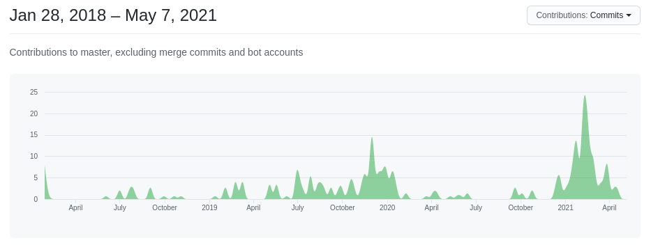
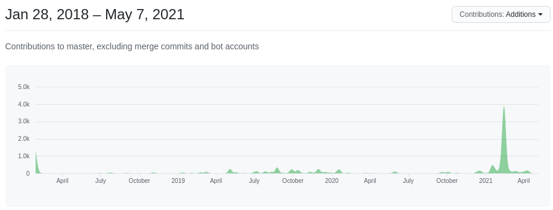

If you take a look at GitHub's page which graph contributions to Flatpak External Data Checker itself over time, I think the graphs of number of commits and number of lines added speak to the scale of his contributions to this project. I have to confess that I have barely worked on it myself this year, so I'd like to thank gas in vein, and for that matter everyone else who's contributed over the past year or so, for keeping this project moving.

## Updates by month

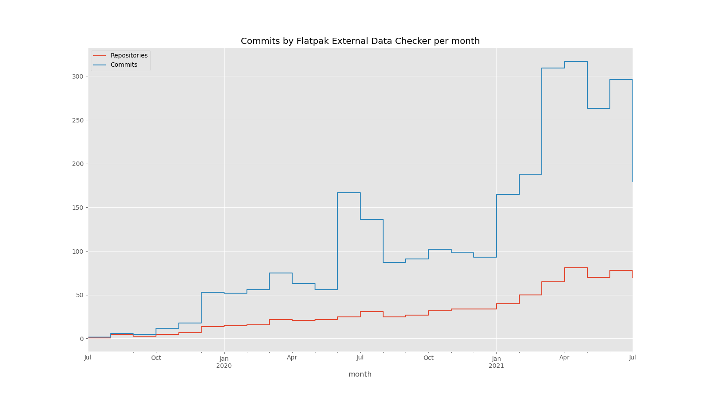

Anyway, back to what the tool does. Here I've plotted the number of repositories to which an update from Flatpak External Data Checker was merged in any given month, and the number of changes. Not every app has an update every month, which is why the number of repositories updated in the last few months is just 50 or so. But the number of commits it makes is consistently much higher, so it's updating some apps more than once a month. For the last two months, it's been over 300 commits per month.

## Top apps

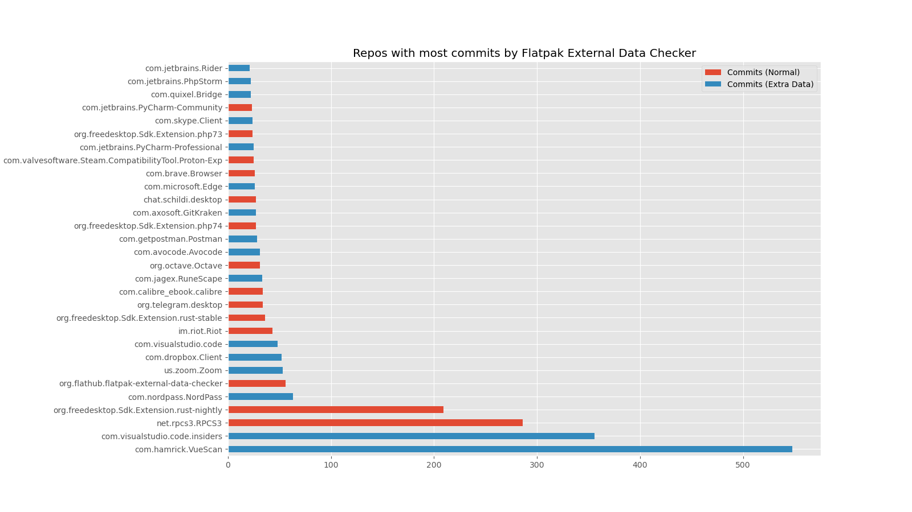

Here are the top 30 apps and runtimes by number of commits authored by flatpak-external-data-checker.

I've coloured the bars by whether the the app is extra-data or not. I've just realised that the colours are the opposite way round compared to the earlier slide... Here, extra-data apps are red, and normal apps are blue.

Of course this will be biased towards apps which have been using the tool for longer. 

Even so, we can see quite an even split between extra-data and normal apps. For instance, the third-most-frequently-updated app on this list is RPCS3, a PlayStation 3 emulated released under the GPL. Flathub tracks the `master` branch of the upstream project. I guess this is a fast-moving project where being at the bleeding edge is worth the potential for the occasional broken build if it means better compatibility with games. High up here, we also see the nightly build of the Rust toolchain, which is open source, as well as the Insiders (a.k.a. nightly) build of Visual Studio Code, which isn't.

## Kinds of app

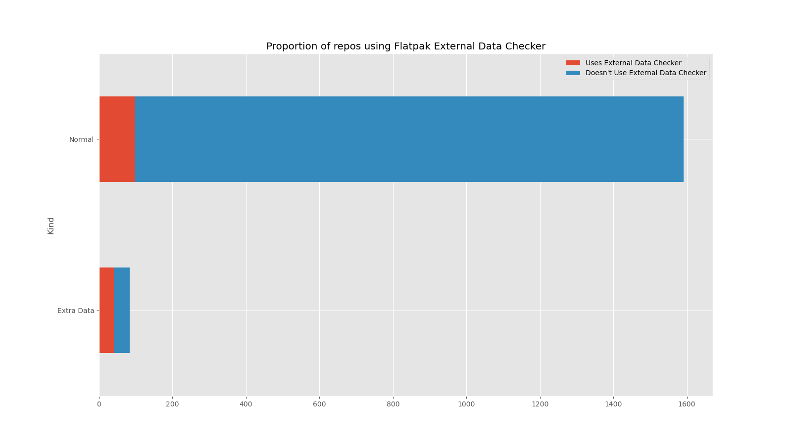

This made me wonder: if so many of the most-frequently-updated repositories are in fact open-source or fully distributed by Flathub, how does that compare to the proportion of apps of each kind on Flathub as a whole?

As I've mentioned, of the 112 repos that external data checker has ever updated, just 36 are extra-data. The remaining 76 are normal, redistributable Flatpaks. This is actually almost as many as the 79 extra-data apps that Flathub has in total. But in relative terms, the external data checker is used for almost half (45%) of those extra-data apps, compared to just 5% of other apps.

(If you are wondering why this chart shows almost 1,600 apps on Flathub, while `flatpak remote-list --app` shows a smidge over 1,200 and other lists fewer still, it's because I am including runtimes, extensions–like over 100 plugins for digital audio workstations!—and EOLed apps.)

Personally, I find these numbers quite reassuring. I think it is reasonable to ask whether it is really desirable for Flathub to publish these extra-data wrappers for proprietary apps. Even if you ignore the free software angle, I'll quote [from the Flathub website](https://github.com/flathub/flathub/wiki/App-Submission#someone-else-has-put-my-app-on-flathubwhat-do-i-do):

> Flathub is primarily intended as a service that is used by app developers to distribute their apps. […] We would prefer that [applications on Flathub] are controlled by their authors.

So, is this tool making it too easy (if you like) to publish wrappers rather than encouraging app developers to publish their own apps on Flathub for real?

Like Flathub as a whole, I take a pragmatic stance on this. There are some apps which people really do need to be able to run on their computers. The last year has shown us that running Zoom and Microsoft Teams and so on is, for better or for worse, not a matter of choice for a lot of people. At least by distributing them with Flatpak, there is a chance that they are more tightly sandboxed than a traditional distro package would be; and because Flatpak apps can be safely automatically upgraded in the background while the app is running, automating the publication of new versions means that fixes reach users more promptly.

## Chromium

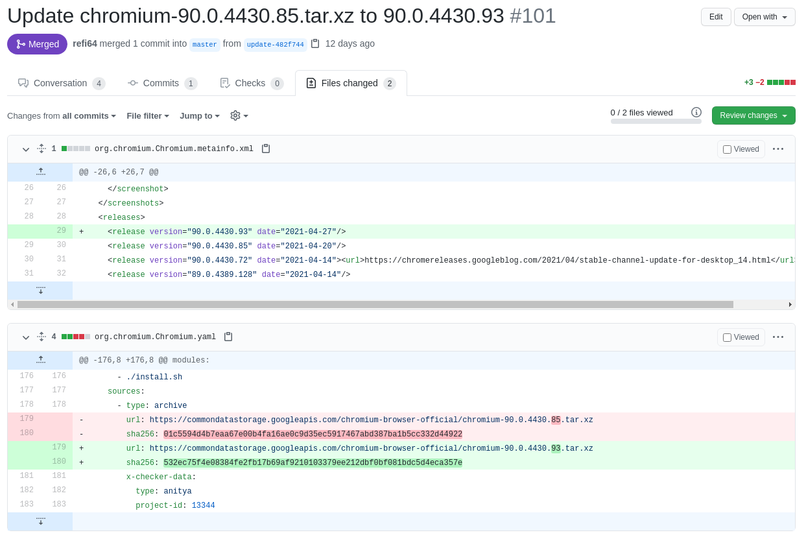

And these things are true for open-source software as well, which is 95% of the software on Flathub, and Flatpak External Data Checker evidently helps many people to keep those apps up-to-date as well.

One important class of software that needs to be kept up-to-date is web browsers. Chromium has been on Flathub for about six months. It has a very rapid major release cadence, releasing every six weeks, and I think this is going down to four weeks soon. And even in between those releases, it's pretty common to see one or more point releases, which almost always fix serious security vulnerabilities.

The Chromium repository on Flathub is wired up to Flatpak External Data Checker, so whenever a new release appears, a PR is quickly created, and a test build is made. Major updates tend to need manual intervention since the Flathub version has a dozen or so patches to better integrate with Flatpak, but point releases tend to build cleanly. Back when we built Chromium into Endless OS itself, any point release involved a developer manually rebasing the package, building it, waiting several hours for a test build to appear, testing it, and finally releasing it… oh, except that Endless OS only releases monthly so we would have to decide whether to issue an emergency release of the OS, or delay getting updates to end-users. Now, the workflow is: a pull request appears automatically, followed quickly by a test build; someone tests that, and presses Merge. That's it.

Personally, I publish a few of my own apps on Flathub, and somewhat maintain the Flatpaks for perhaps a dozen more, most of which are open source. Getting notified of a new upstream TuxPaint releases in the form of an easily-testable pull request really helps to make this manageable. Even in the case when you are publishing your own app on Flathub, it's nice to have a computer programme do the boring work of updating a JSON file for you.

Of course, there are other models that could work just as well, or better. The Firefox Flatpak on Flathub comes directly from Mozilla, and rather than being built by Flathub's infrastructure, it is pushed directly to Flathub by Mozilla's release process. So security updates for Firefox hit Flathub the moment they are released by Mozilla, without any delay.

# How do I use it?

OK! Hopefully, I've convinced you that this tool is useful to you as an app developer, or as the maintainer of a Flatpak. Or perhaps you are submitting an extra-data app to Flathub and have discovered that this tool is mandatory! How do you actually use it?

In short, you generally need to add some special annotations to the app's manifest to tell Flatpak External Data Checker how to check for new versions of the app. It has almost a dozen different checkers for various scenarios. I won't describe them all here but I'll give a few illustrative examples.

## Rotating URL

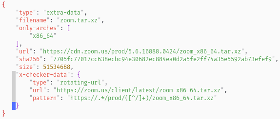

```json
{
    "type": "extra-data",
    "filename": "zoom.tar.xz",
    "only-arches": [
        "x86_64"
    ],
    "url": "https://cdn.zoom.us/prod/5.6.16888.0424/zoom_x86_64.tar.xz",
    "sha256": "7705fc77017cc638ecbc94e30682ec884ea0d2a5fe2ff74a35e5592ab73efef9",
    "size": 51534688,
    "x-checker-data": {
        "type": "rotating-url",
        "url": "https://zoom.us/client/latest/zoom_x86_64.tar.xz",
        "pattern": "https://.*/prod/([^/]+)/zoom_x86_64.tar.xz"
    }
}
```

In case you're not familiar with Flatpak manifests, most of this is quite standard. This is a paragraph from a JSON file which tells Flatpak that Zoom should be downloaded from the given URL install time, and what the file's expected checksum and size are. The `x-checker-data` section is specific to Flatpak External Data Checker, and is ignored by `flatpak-builder`.

In this case, Zoom has a special URL which always redirects to the latest version of the app. So we have an `x-checker-data` section which tells the checker to use the `rotating-url` checker. We tell it the URL that redirects to the latest version of Zoom, and we provide a regular expression to extract the version number from that target URL.

That's all you need to do. Every hour, Flathub runs the external data checker on this repo; if it finds an update, it opens a pull request. Because we told it how to extract the version number, it can also update the *appdata* file in the repository.

## AppImage & merging automatically

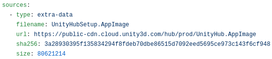

```yaml
sources:
  - type: extra-data
    filename: UnityHubSetup.AppImage
    url: https://public-cdn.cloud.unity3d.com/hub/prod/UnityHub.AppImage
    sha256: 3a28930395f135834294f8fdeb70dbe86515d7092eed5695ce973c143f6cf948
    size: 80621214
```

Here's another example, this time using YAML syntax. It's for Unity Hub, which is a app which can be used in turn to download and run Unity, the popular game development platform. Unity Hub is distributed as an AppImage file, which funnily enough is a competing Linux app distribution tool. Flatpak External Data Checker has special handling for `.AppImage` files – it unpacks them to find the version number within.

This is an example of the situation I described earlier, where each new version is published at the same URL as the old one; so every time a new version of Unity Hub is released, the Flatpak can't be installed until its manifest is updated on Flathub. We actually forgot to add this app to the big Endless Jenkins job once it was accepted on Flathub, and it broke almost immediately without us noticing.

Generally, a human being is expected to have tested that an app update works before publishing it on Flathub, so the external data checker just opens a pull request and waits for a human to merge it. But in this case, it detects that the existing version on Flathub is broken, and will automatically merge its own PR if its CI checks pass.

So the happy news here is: no extra configuration was needed in the manifest to let the checker do its thing.

<!--
## Snapcraft

```json
{
    "type": "extra-data",
    "filename": "spotify.snap",
    "only-arches": [
        "x86_64"
    ],
    "url": "https://api.snapcraft.io/api/v1/snaps/download/pOBIoZ2LrCB3rDohMxoYGnbN14EHOgD7_46.snap",
    "sha256": "441e022ef186ef4278558490a61962b8940b398baa7934311a3c3d01d43b46c9",
    "size": 188289024,
    "x-checker-data": {
        "type": "snapcraft",
        "name": "spotify",
        "channel": "stable"
    }
}
```

Surprise! You came to a Flatpak talk, and now I'm going to talk about Snap!

When Spotify was first added to Flathub, Spotify would distribute a `.deb` package of each version. But recently, Spotify stopped releasing `.deb` packages, and only publish new versions on Snapcraft.

Happily, the Snap build can be made to run in a Flatpak, so the Flatpak app was updated to use the Snap as its extra-data source. And also happily, Rebecca Wallander contributed a Snap checker to Flatpak External Data Checker last year, which makes it very simple to keep it updated automatically: just tell it to use the snapcraft checker, for the stable channel of the spotify app. Done.

It's definitely a bit weird that there are apps on Flathub which end up downloading the app itself from Snap, and I think there's an interesting developer advocacy question here. But again, we can be pragmatic here: evidently it works, and keeping it up to date is very simple. As a Spotify user, I didn't even notice this change. I only realised it had happened when I was preparing this talk.
-->

## Anitya

```yaml
- type: archive
  url: https://commondatastorage.googleapis.com/chromium-browser-official/chromium-90.0.4430.72.tar.xz
  sha256: a5cc88ca8fffac21ec4d1646980f698dfb6f388a225dd7a2c5a3d252a4098943
  x-checker-data:
    type: anitya
    project-id: 13344
    stable-only: true
    url-template: https://commondatastorage.googleapis.com/chromium-browser-official/chromium-$version.tar.xz
```

I mentioned earlier that gasinvein added a backend to find new versions using release-monitoring.org, which is also known as "anitya" and is maintained by Fedora. If you're the developer of an open-source application, or maintain a Flatpak for one, this could be interesting for you.

Here's an example of how that's used for the Chromium Flatpak. It's similar to the Snapcraft example, except that we need to give a numeric ID for the project, which you can find on the release-monitoring.org website, and provide a URL template with a placeholder for the version. But that's it!

The other difference here is that the source is of type "archive", not "extra-data". This means that it is downloaded and compiled at build time, on Flathub's build server, rather than on the end-user's system.

There are similar checkers for GNOME components, PyPI packages, Rust packages, and so on.


## JSON

```json
{
    "type": "git",
    "url": "https://github.com/telegramdesktop/tdesktop.git",
    "tag": "v2.7.5",
    "commit": "f1a9884011ca3684afd36469ba0c439b17fc0927",
    "x-checker-data": {
        "type": "json",
        "url": "https://api.github.com/repos/telegramdesktop/tdesktop/releases",
        "tag-query": "first | .tag_name",
        "timestamp-query": "first | .published_at",
        "version-query": "$tag | sub(\"^[vV]\"; \"\")"
    }
}
```

Here's a slightly more complicated example. I mentioned earlier that Telegram was the motivation for adding a general-purpose JSON plugin. There are four inputs to the checker in this example: the URL of a JSON file, and three query expressions which tell the checker how to find the Git tag of the latest release, the timestamp at which it was made, and how to parse the tag to extract the version.

The queries are expressed in the syntax used by the popular [`jq`](https://stedolan.github.io/jq/) JSON-processing tool. Actually, Flatpak External Data Checker uses `jq` to implement this checker.

You might hope that you'd be able to handle Git tags automatically, but unfortunately it's not so simple. Different projects use different naming conventions for their tags, and there is no way to ask a random Git server for the timestamp on a tag without fetching the tag, which can be really expensive for large repositories. The JSON checker is a really powerful tool that can be used for all kinds of sources, not just Git ones.

## Updating dependencies

```json
{
    "type": "git",
    "url": "https://github.com/LudovicRousseau/PCSC.git",
    "tag": "pcsc-1.9.0",
    "commit": "e796a0f12fbefa459bff0d25e27089615fa91f21",
    "x-checker-data": {
        "type": "git",
        "tag-pattern": "^pcsc-([\\d.]+)$"
    }
}
```

There are some cases when you can handle Git tags more straightforwardly.

All the examples I've given so far are for keeping the app itself up-to-date, but you can use Flatpak External Data Checker to keep dependencies up-to-date, too. Here's an excerpt from the manifest for Remmina, an open-source remote desktop client, which has many dependencies. Most of them have `x-checker-data` annotations to automate updates. Here's an example using the `git` checker to keep the Flatpak updated with new releases of the PCSC smartcard library, which tells Flatpak External Data Checker to check for git tags matching the given regular expression.

## Automerge

```yaml
# flathub.json
{
  "automerge-flathubbot-prs": true
}

```

There are some rare situations where you want the checker to automatically merge its own pull requests. We saw one earlier with the PlayStation emulator, but here's another example.

There's a Flathub beta repository, which contains apps that for whatever reason aren't ready for general consumption. The “Insiders” unstable channel of Visual Studio Code is published here. The whole point of using this build of VS Code is to get early access to features and changes that may or may not work properly, so it's again worth the risk of the occasional broken version of the app to get those updates through automatically.

You can opt into this behaviour by setting a flag in a `flathub.json` file in the same repository as the 

## Test it yourself with Flatpak

```
flatpak install flathub org.flathub.flatpak-external-data-checker
cd src/flathub/com.example.Foo
flatpak run --filesystem=`pwd` \
  org.flathub.flatpak-external-data-checker \
  --edit-only \
  com.example.Foo.json
```

Suppose you want to test your configuration locally, rather than pushing it to Flathub and waiting up to an hour to see what happens. It's quite easy to run the tool yourself.

The checker is published as a Flatpak on Flathub, and (of course) it keeps itself up-to-date automatically. It's not visible in GUI frontends, so you need to install it from the command line. Having done that, you need to pass `--filesystem` to give it access to your manifest.

By default, it just prints out what it would like to do on the terminal. The `--edit-only` flag tells it to make changes to your working copy, but not commit them or try to open a pull request. There are other flags, which you can find with `--help`. If you want it to open a pull request, you'll need to give it a GitHub API key.

## Podman / Docker

```
podman run --rm -it -v `pwd`:`pwd` \
	ghcr.io/flathub/flatpak-external-data-checker:latest \
	--edit-only \
    com.example.Foo.yaml
```

If you prefer Docker or Podman, maybe because you want to run it on Jenkins or something, it's also available as a Docker container on the GitHub Container Registry. The invocation is similar: you need to mount a volume containing the manifest you want it to check.

There's a `Dockerfile` in the repository, which might be useful for developing the checker itself.

# Get Involved

https://github.com/flathub/flatpak-external-data-checker

Future plans:

- Runtime updates?
- Automatically run language-specific manifest generators from flatpak-builder-tools?

If you're interested in contributing to Flatpak External Data Checker itself, there are plenty of ways to do so.

Probably the most obvious one is to start using it on your own app, and give feedback on how it works for you. If you are keen on writing documentation, the user's perspective is always very valuable. You could also contribute checkers for new software sources, or perhaps add more “magic” to some of the existing ones.

I hear that even cronjobs get logos these days, so maybe you'd like to make a logo for the project. And actually, over the course of this talk I've realised that saying “Flatpak External Data Checker” over and over again can be a bit clumsy. So… maybe you can think of a snappier name!

# Thanks!

Word cloud?

I'd like to thank all those who have contributed to this tool over the past few years. It's come a long way from a bash script on a private Jenkins instance!

Any questions?
