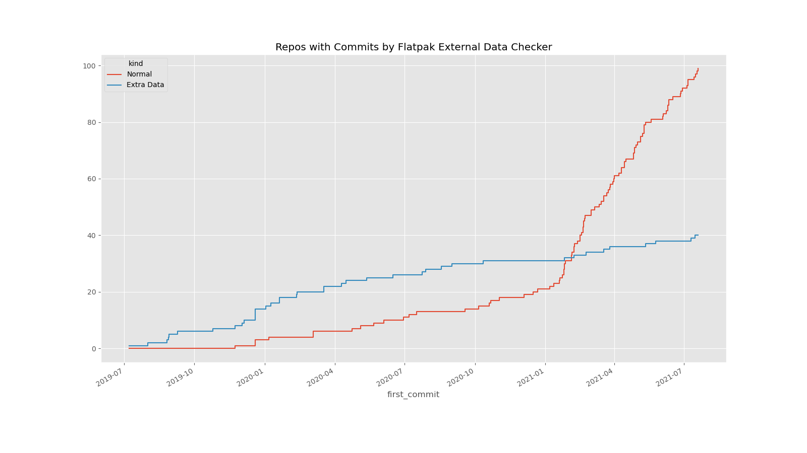

# Title

Good afternoon from London! My name is Will Thompson. I'm Director of OS at Endless OS Foundation. Our mission is to help all people and communities connect with technology. I'll say a bit more about Endless OS itself later.

Today I'm going to talk about Flatpak External Data Checker, which helps keep Flatpaks up-to-date with new releases of the app or its dependencies.

# What is Flatpak?

<!--
 
-->

To understand the motivation for this tool, it helps to know a few facts about Flatpak and Flathub.

On Flathub, the build process for most apps is defined by a *manifest* file in JSON or YAML format, stored in a repository on GitHub. The manifest is essentially a list of all the app's dependencies, and how to build and install each one from source code in sequence, followed by how to build and install the app. The repository does not contain the source code for the app or its dependencies. For some apps the manifest is very simple, because all the necessary dependencies are already present in the Flatpak runtime. Some other apps have hundreds or thousands of dependencies, typically from PyPI or NPM, and these apps' manifests are generated by other tools. Most apps are somewhere in the middle, with a small handful of dependencies and a manifest maintained by hand.

Another Flatpak repository you may have come across is the GNOME Nightly repository; this tool is not relevant to that repository.

## Endless OS, 2016


This tool originally came out of Endless OS, which is a GNOME-based desktop OS with some properties borrowed from mobile OSes. Like iOS, Android, and Fedora Silverblue, but unlike most traditional Linux distributions, each release of Endless OS is an immutable OSTree snapshot. So although it's derived from Debian, it's not possible to install new apps using tools like `dpkg`.

Back in 2016, we rebuilt Endless OS to use Flatpak for apps. I borrowed this image from the [press release announcing Flatpak](https://flatpak.org/press/2016-06-21-flatpak-released/) back in 2016. Flatpak apps are hermetically-sealed snapshots, just like the OS. Among other things, this is great for robust automatic updates, both of the OS and of the apps. (By the way, GNOME OS also uses OSTree plus Flatpaks, and uses the Endless OS Updater, which happily is already plumbed into GNOME Software.)

Endless OS has many unique apps for offline content, built using a custom Flatpak runtime and build pipeline, and published in our own Flatpak repository. But, of course, users need regular apps too, for productivity, creativity and chaos. Back then, Flathub didn't exist, so we built a bunch of Flatpaks for third-party apps, and put them in our own Flatpak repository, too. We moved these apps to Flathub in due course.

Most of them were open-source, but our users expected to be able to use Skype, Spotify and Dropbox, so these were built as extra-data apps.

## Extra Data

[Skype installation diagram]

Normally, users download the complete app from the Flatpak repository as a single snapshot. But Flatpak has a somewhat-unusual feature, which allows apps to download and unpack additional files from third-party servers when they are installed. This feature mainly exists to support installing proprietary applications using Flatpak despite the repository owner not having permission to redistribute them.

For example, here's what happens when you install Skype from Flathub. First, Flatpak on your computer fetches and installs the `com.skype.Client` Flatpak from Flathub, and the FreeDesktop.org runtime it depends on if you don't already have it installed. This Flatpak app contains the open-source libraries that Skype depends on, like v4l-utils and libsecret, but it doesn't actually contain Skype itself. Instead, it contains the URL to the `.deb` package of Skype, the expected size and SHA256 checksum of that file, and a script to unpack it.

Next, Flatpak on your computer downloads that file, directly from Skype. It verifies that the `.deb` file has the expected size and checksum, and then it runs the script provided by the Flatpak app to unpack it. This script is run in a strict sandbox, and once it's finished, the files it's extracted are made read-only, just like all the other files in a Flatpak app. Flathub didn't distribute Skype itself, but the end result once you install the app is almost the same as if it had.

## Extra Data gone bad

[Diagram of two failure cases]

Perhaps you can already see the ways this can go wrong. When a new version of Skype is released, the URL to the old version will eventually stop working, so if the Flatpak app is not updated before then, new users will not be able to install it. Even worse, sometimes vendors publish a new version of an app at the same URL as the old version. Since the new version will have a different checksum, Flatpak will refuse to unpack it, and again installation will fail.

So, we needed a way to keep these extra-data Flatpaks up-to-date, ideally automatically. We wrote some scripts to do this, which evolved into flatpak-external-data-checker as it is today.

## Move to Flathub


Bartłomiej Piotrowski is a DevOps engineer at the GNOME Foundation, and is one of the main administrators of Flathub.
Near the end of 2019, he deployed Flatpak External Data Checker on Flathub's own infrastructure, and we moved the repository to the Flathub organisation. It runs every hour, and checks any app on Flathub that had the appropriate configuration in its manifest.

It was also made a [requirement](https://github.com/flathub/flathub/wiki/App-Requirements#external-data-checker) that new extra-data apps submitted to Flathub should integrate with this tool. Together, these also led to more people contributing to the project.

This PR for Zoom seems to have been the first one opened by the Flathub instance of this tool.

One of the really nice things about this workflow is that Flathub's own continuous integration automatically makes a test build of every pull request. So as a maintainer, you just have to install and test that test build, and (assuming it works) accept the pull request.

## Becoming a general-purpose app updater



When it was rolled out to Flathub, something interesting happened: Flatpak External Data Checker started to be used not only to keep extra-data Flatpaks up-to-date, but also to keep regular Flatpaks up-to-date as well.

When I prepared this talk, there were 139 repositories on Flathub which have been updated by this tool at least once in their history. Of those, only 40 are extra-data: that's the blue line in this graph. The remaining 99 are normal Flatpaks that Flathub can build and distribute in full. That's the red line in this graph.

You can probably see that both lines went up steadily over the course of 2020, after this tool was deployed on Flathub.

It really exploded in popularity for normal Flatpaks since the start of this year, 2021. A prolific Flathub contributor, who goes by the username "gas in vein", became a comaintainer of Flatpak External Data Checker near the end of 2020 and contributed many nice improvements. Motivated by trying to keep up with rapid release to the open-source Telegram app, he added several new ways to look for updated versions, such as by checking release-monitoring.org, and using a general-purpose JSON parser. As well as Telegram, these made it possible to check and automatically update many more apps.

I have to confess that I have barely worked on it myself this year, so I'd like to thank gas in vein for keeping this project moving forward.

## Updates by month


Here I've plotted the number of repositories to which an update from Flatpak External Data Checker was merged in any given month, and the number of changes. Not every app has an update every month, which is why the number of repositories updated in the last few months is 70 or so, about half of the 139 repos it's ever committed to. But the number of commits it makes is consistently much higher, so it's updating some apps more than once a month. The peak was in April, with 317 commits across 81 repos.

## Top apps


Here are the top 30 apps and runtimes by number of commits authored by flatpak-external-data-checker.

Again I've coloured the bars by whether the the app is extra-data or not.

Of course this will be biased towards apps which have been using the tool for longer. 

Even so, we can see quite an even split between extra-data and normal apps. For instance, the third-most-frequently-updated app on this list is RPCS3, a PlayStation 3 emulated released under the GPL. Flathub tracks the `master` branch of the upstream project. I guess this is a fast-moving project where being at the bleeding edge is worth the potential for the occasional broken build if it means better compatibility with games. High up here, we also see the nightly build of the Rust toolchain, which is open source, as well as the Insiders (a.k.a. nightly) build of Visual Studio Code, which isn't.

## Kinds of app


This made me wonder: if so many of the most-frequently-updated repositories are in fact open-source or fully distributed by Flathub, how does that compare to the proportion of apps of each kind on Flathub as a whole?

The checker is checking 99 normal, redistributable Flatpaks, which is actually more than the 83 extra-data apps that Flathub has in total. But in relative terms, the external data checker is used for almost half (48%) of those extra-data apps, compared to just 6% of other apps.

(If you are wondering why this chart shows over 1,600 apps on Flathub, while `flatpak remote-ls --app flathub` shows nearly 1,300 and other lists fewer still, it's because I am including runtimes, extensions–like over 100 plugins for digital audio workstations!—and EOLed apps.)

Personally, I find these numbers quite reassuring. I think it is reasonable to ask whether it is really desirable for Flathub to publish these extra-data wrappers for proprietary apps. Even if you ignore the free software angle, I'll quote [from the Flathub website](https://github.com/flathub/flathub/wiki/App-Submission#someone-else-has-put-my-app-on-flathubwhat-do-i-do):

> Flathub is primarily intended as a service that is used by app developers to distribute their apps. […] We would prefer that [applications on Flathub] are controlled by their authors.

So, is this tool making it too easy (if you like) to publish wrappers rather than encouraging app developers to publish their own apps on Flathub for real?

Like Flathub as a whole, I take a pragmatic stance on this. There are some apps which people really do need to be able to run on their computers. The last year has shown us that running Zoom and Microsoft Teams and so on is, for better or for worse, not a matter of choice for a lot of people. At least by distributing them with Flatpak, there is a chance that they are more tightly sandboxed than a traditional distro package would be; and because Flatpak apps can be safely automatically upgraded in the background while the app is running, automating the publication of new versions means that fixes reach users more promptly.

## Chromium


And these things are true for open-source software as well, which is 95% of the software on Flathub, and Flatpak External Data Checker evidently helps many people to keep those apps up-to-date as well.

One important class of software that needs to be kept up-to-date is web browsers. Chromium has been on Flathub for about six months. It has a very rapid major release cadence, releasing every six weeks, and I think this is going down to four weeks soon. And even in between those releases, it's pretty common to see one or more point releases, which almost always fix serious security vulnerabilities.

The Chromium repository on Flathub is wired up to Flatpak External Data Checker, so whenever a new release appears, a PR is quickly created, and a test build is made. Major updates tend to need manual intervention since the Flathub version has a dozen or so patches to better integrate with Flatpak, but point releases tend to build cleanly. Back when we built Chromium into Endless OS itself, any point release involved a developer manually rebasing the package, building it, waiting several hours for a test build to appear, testing it, and finally releasing it… oh, except that Endless OS only releases monthly so we would have to decide whether to issue an emergency release of the OS, or delay getting updates to end-users. Now, the workflow is: a pull request appears automatically, followed quickly by a test build; someone tests that, and presses Merge. That's it.

Personally, I publish a few of my own apps on Flathub, and somewhat maintain the Flatpaks for perhaps a dozen more, most of which are open source. Getting notified of a new upstream TuxPaint releases in the form of an easily-testable pull request really helps to make this manageable. Even in the case when you are publishing your own app on Flathub, it's nice to have a computer programme do the boring work of updating a JSON file for you.

Of course, there are other models that could work just as well, or better. The Firefox Flatpak on Flathub comes directly from Mozilla, and rather than being built by Flathub's infrastructure, it is pushed directly to Flathub by Mozilla's release process. So security updates for Firefox hit Flathub the moment they are released by Mozilla, without any delay. You could in principle imagine pushing GNOME apps to Flathub in the same way, as we already do for the GNOME Flatpak runtime.

# How do I use it?

OK! Hopefully, I've convinced you that this tool is useful to you as an app developer, or as the maintainer of a Flatpak. Or perhaps you are submitting an extra-data app to Flathub and have discovered that this tool is mandatory! How do you actually use it?

In short, you generally need to add some special annotations to the app's manifest to tell Flatpak External Data Checker how to check for new versions of the app. It has almost a dozen different checkers for various scenarios. I won't describe them all here but I'll give a few illustrative examples.

## GNOME

```json
{
    "type": "archive",
    "url": "https://download.gnome.org/sources/d-feet/0.3/d-feet-0.3.16.tar.xz",
    "sha256": "8733ce4b9a9a54ec185b1d85bf4da9d9d11052882a880760ff60f9779b2d1ccb",
    "x-checker-data": {
        "type": "gnome",
        "name": "d-feet",
        "//": "D-Feet does not follow the odd/even stable branch convention",
        "stable-only": false
    }
}
```

This is GUADEC, so I'll start with a GNOME-specific example. This is an excerpt from the D-Feet manifest.

In case you're not familiar with Flatpak manifests, most of this is quite standard. This is a paragraph from a JSON file which tells flatpak-builder where to get the D-Feet source code at build time, and what its expected checksum is. The `x-checker-data` section is specific to Flatpak External Data Checker, and is ignored by `flatpak-builder`.

Here, we tell Flatpak External Data Checker to use its GNOME backend, using the "d-feet" module. This backend understands GNOME's version number conventions, but D-Feet does not follow these, so we set stable-only to false to disable this behaviour.

That's all you need to do. Every hour, Flathub runs the external data checker on this repo; if it finds an update, it opens a pull request.

## JSON, and dependencies

```json
{
    "type": "archive",
    "url": "https://github.com/pygobject/pycairo/releases/download/v1.20.0/pycairo-1.20.0.tar.gz",
    "sha256": "5695a10cb7f9ae0d01f665b56602a845b0a8cb17e2123bfece10c2e58552468c",
    "x-checker-data": {
        "type": "json",
        "url": "https://api.github.com/repos/pygobject/pycairo/releases/latest",
        "version-query": ".tag_name | sub(\"^v\"; \"\")",
        "url-query": ".assets[] | select(.name==\"pycairo-\" + $version + \".tar.gz\") | .browser_download_url"
    }
}
```

You can use Flatpak External Data Checker to keep dependencies up-to-date, too. Here's another part of the D-Feet manifest, which uses the general-purpose JSON checker to keep pycairo up to date. There are three inputs to the checker in this example: the URL of a JSON file, and two query expressions which tell the checker how to find the Git tag of the latest release, and how to parse the tag to extract the version.

The queries are expressed in the syntax used by the popular [`jq`](https://stedolan.github.io/jq/) JSON-processing tool. Actually, Flatpak External Data Checker uses `jq` to implement this checker.

The JSON checker is a really powerful tool that can be used for all kinds of sources, not just Git ones.

## Git tags

```json
{
    "type": "git",
    "url": "https://github.com/LudovicRousseau/PCSC.git",
    "tag": "pcsc-1.9.0",
    "commit": "e796a0f12fbefa459bff0d25e27089615fa91f21",
    "x-checker-data": {
        "type": "git",
        "tag-pattern": "^pcsc-([\\d.]+)$"
    }
}
```

It's not always possible to just use Git tags directly, for reasons beyond the scope of this talk, but sometimes you can.

Here's an excerpt from the manifest for Remmina, an open-source remote desktop client, which has many dependencies. Most of them have `x-checker-data` annotations to automate updates. This one uses `git` checker to keep the Flatpak updated with new releases of the PCSC smartcard library, which tells Flatpak External Data Checker to check for git tags matching the given regular expression.

## Anitya

```yaml
- type: archive
  url: https://commondatastorage.googleapis.com/chromium-browser-official/chromium-90.0.4430.72.tar.xz
  sha256: a5cc88ca8fffac21ec4d1646980f698dfb6f388a225dd7a2c5a3d252a4098943
  x-checker-data:
    type: anitya
    project-id: 13344
    stable-only: true
    url-template: https://commondatastorage.googleapis.com/chromium-browser-official/chromium-$version.tar.xz
```

I mentioned earlier that gasinvein added a backend to find new versions using release-monitoring.org, which is also known as "anitya" and is maintained by Fedora. They've done a lot of the hard work of tracking new versions of various packages.

Here's an example of how that's used for the Chromium Flatpak, this time using YAML syntax. We need to give a numeric ID for the project, which you can find on the release-monitoring.org website, and provide a URL template with a placeholder for the version, since anitya can't give us that. But that's it!

## AppImage & merging automatically


```yaml
sources:
  - type: extra-data
    filename: UnityHubSetup.AppImage
    url: https://public-cdn.cloud.unity3d.com/hub/prod/UnityHub.AppImage
    sha256: 3a28930395f135834294f8fdeb70dbe86515d7092eed5695ce973c143f6cf948
    size: 80621214
```

Here's one last example, for Unity Hub, which is a proprietary app which can be used in turn to download and run Unity, the popular game development platform. Unity Hub is distributed as an AppImage file, which funnily enough is a competing Linux app distribution tool. Flatpak External Data Checker has special handling for `.AppImage` files – it unpacks them to find the version number within.

This is an example of the situation I described earlier, where each new version is published at the same URL as the old one; so every time a new version of Unity Hub is released, the Flatpak can't be installed until its manifest is updated on Flathub. We actually forgot to add this app to the big Endless Jenkins job once it was accepted on Flathub, and it broke almost immediately without us noticing.

Generally, a human being is expected to have tested that an app update works before publishing it on Flathub, so the external data checker just opens a pull request and waits for a human to merge it. But in this case, it detects that the existing version on Flathub is broken, and will automatically merge its own PR if its CI checks pass.

So the happy news here is: no extra configuration was needed in the manifest to let the checker do its thing.

## Automerge 35:40

```yaml
# flathub.json
{
  "automerge-flathubbot-prs": true
}
```

There are some other situations where you want the checker to automatically merge its own pull requests.

There's a Flathub beta repository, which contains apps that for whatever reason aren't ready for general consumption. The “Insiders” unstable channel of Visual Studio Code is published here. The whole point of using this build of VS Code is to get early access to features and changes that may or may not work properly, so it's again worth the risk of the occasional broken version of the app to get those updates through automatically.

You can opt into this behaviour by setting a flag in a `flathub.json` file in the same repository as the manifest.

## Test it yourself with Flatpak

```
flatpak install flathub org.flathub.flatpak-external-data-checker
cd src/flathub/com.example.Foo
flatpak run --filesystem=`pwd` \
  org.flathub.flatpak-external-data-checker \
  --edit-only \
  com.example.Foo.json
```

Suppose you want to test your configuration locally, rather than pushing it to Flathub and waiting up to an hour to see what happens. It's quite easy to run the tool yourself.

The checker is published as a Flatpak on Flathub, and (of course) it keeps itself up-to-date automatically. It's not visible in GUI frontends, so you need to install it from the command line. Having done that, you need to pass `--filesystem` to give it access to your manifest.

By default, it just prints out what it would like to do on the terminal. The `--edit-only` flag tells it to make changes to your working copy, but not commit them or try to open a pull request. There are other flags, which you can find with `--help`. If you want it to open a pull request, you'll need to give it a GitHub API key.

## Podman / Docker

```
podman run --rm -it -v `pwd`:`pwd` \
	ghcr.io/flathub/flatpak-external-data-checker:latest \
	--edit-only \
    com.example.Foo.yaml
```

If you prefer Docker or Podman, maybe because you want to run it on Jenkins or something, it's also available as a Docker container on the GitHub Container Registry. The invocation is similar: you need to mount a volume containing the manifest you want it to check.

There's a `Dockerfile` in the repository, which might be useful for developing the checker itself.

# Get Involved

https://github.com/flathub/flatpak-external-data-checker

Future plans:

- Runtime updates?
- Automatically run language-specific manifest generators from flatpak-builder-tools?

If you're interested in contributing to Flatpak External Data Checker itself, there are plenty of ways to do so.

Probably the most obvious one is to start using it on your own app, and give feedback on how it works for you. If you are keen on writing documentation, the user's perspective is always very valuable. You could also contribute checkers for new software sources, or perhaps add more “magic” to some of the existing ones.

One thing I realised by giving this talk is that saying “Flatpak External Data Checker” over and over again can be a bit clumsy. So… maybe you can think of a snappier name!

I hear that even cronjobs get logos these days, so maybe you'd like to make a logo for the project.

I'd like to thank all those who have contributed to this tool over the past few years. It's come a long way from a bash script on a private Jenkins instance!

Any questions?
